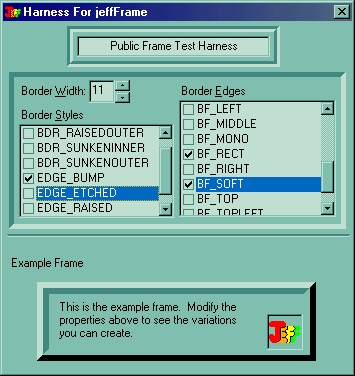

<div align="center">

## jeffFrame \(enhanced VB Frame control\)


</div>

### Description

This user control is my own personal replacement for the VB frame control. It more closely emulates the "panels" found in many 3rd party control libraries. It is an excellent example of using the DrawEdge API function. The control exposes 3 properties to this affect: BorderWidth, BorderEdges, and BorderStyle. The sample app visually demonstrates how these properties affect the control. In all of my personal code, I maintain 2 base modules: 1 for declaring constants and API stuff, and the other for containing generic function. Thus, the sample project includes a subset of those 2 files, plus the UserControl... and a test harness screen that allows you to set the frame properties on the fly. For the current versions of this control, or other cool controls or code, hit my web page:                                                                                                          http://members.tripod.com/thefrogprince/                                                                                                          If you are not currently involved in the coding contest, I WOULD REALLY APPRECIATE YOU VOTING FOR MY CODE. Will only take a minute or two to make an account, and while it won't make me any money... =) it will encourage me to keep posting good quality code and controls like this one.
 
### More Info
 
The control exposes 3 properties to this affect: BorderWidth, BorderEdges, and BorderStyle. The sample app visually demonstrates how these properties affect the control.

In all of my personal code, I maintain 2 base modules: 1 for declaring constants and API stuff, and the other for containing generic function. Thus, the sample project includes a subset of those 2 files, plus the UserControl... and a test harness screen that allows you to set the frame properties on the fly.


<span>             |<span>
---                |---
**Submitted On**   |2001-02-05 19:22:58
**By**             |[TheFrogPrince](https://github.com/Planet-Source-Code/PSCIndex/blob/master/ByAuthor/thefrogprince.md)
**Level**          |Advanced
**User Rating**    |4.8 (53 globes from 11 users)
**Compatibility**  |VB 5\.0, VB 6\.0
**Category**       |[Custom Controls/ Forms/  Menus](https://github.com/Planet-Source-Code/PSCIndex/blob/master/ByCategory/custom-controls-forms-menus__1-4.md)
**World**          |[Visual Basic](https://github.com/Planet-Source-Code/PSCIndex/blob/master/ByWorld/visual-basic.md)
**Archive File**   |[CODE\_UPLOAD14575252001\.zip](https://github.com/Planet-Source-Code/thefrogprince-jeffframe-enhanced-vb-frame-control__1-15048/archive/master.zip)

### API Declarations

```
Public Declare Function DrawEdge Lib "user32" ( ByVal hdc As Long, qrc As Rect, ByVal edge As enumBorderEdges, ByVal grfFlags As enumBorderFlags) As Long
```


